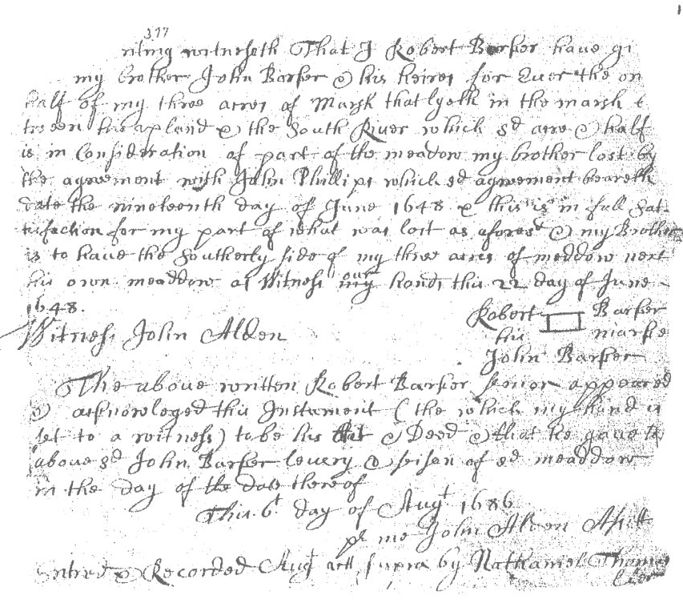
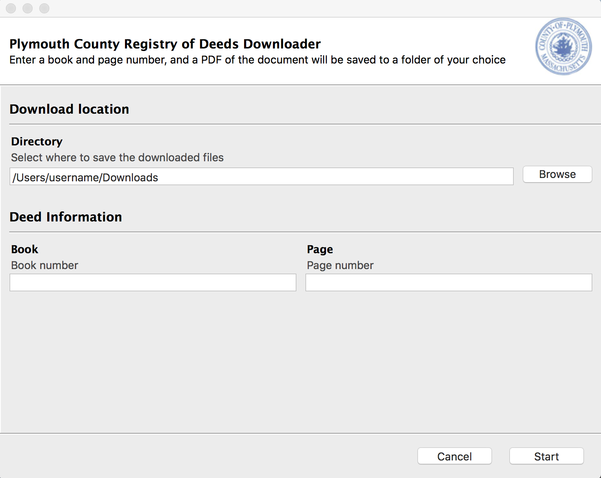

# Deed Finder: Plymouth County Registry of Deeds Download Utility

Downloads recorded land documents from the Plymouth County Registry of Deeds.

**Why?** You can *view* documents for free online (with a watermark), but cannot download or print. Downloading non-watermarked copies require a subscription that costs $30 per month PLUS $1 per downloaded page. :o

This app allows a user to input a Book and Page number (the indexing standard for identifying registry of deed documents) and returns a non-watermarked PDF of the relevant document (for free)!


The first document recorded by the registry of deeds is from 1685. Using it as an example:

| With the app                                       |  Without the app                             |
|:--------------------------------------------------:|:--------------------------------------------:|
|   |   |

## How it works

The registry of deeds website is written using ASP and "secures" documents using a combination of javascript, authentication cookies, and transparent watermark overlays in the HTML DOM.

Therefore, we are able to use a Selenium web browser to bypass the javascript and watermark, obtain the correct auth cookies, and find the URL of the resource we want to download. We then use `requests` to download all pages of the document as images and combin them into a single PDF.

## Getting Started

These instructions will get you a copy of the project up and running on your local machine for development and testing purposes.

### Prerequisites

This app was developed in Python 3. It uses `pipenv` to manage dependencies. The app also requires that the Google Chrome browser is installed on the user's system.

### Installing/Running

You can run the script locally via

```bash
pipenv run python3 deed_finder.py
```

If you would like to package the app, run:

```bash
make build
```


